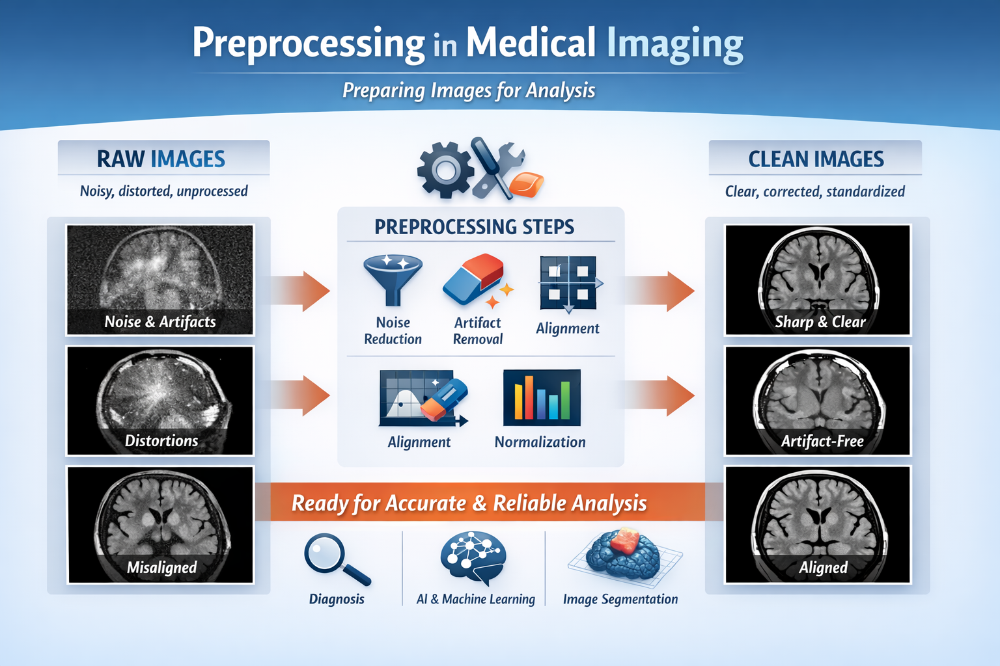

# Introduction
Log analysis is a major part of a support engineer’s work. It is crucial for understanding customer system behavior and diagnosing problems that may arise.

Log files capture thousands and thousandss of data points every day, which makes it difficult to identify patterns, detect unusual behavior, or even understand what is really happening in the system.

Thus, running scripts that retrieve important information, analyze it, and provide insightful results is essential.
In this context, I developed a script for my team that focuses on what we call “preprocessing,” a major pain point for our customers around the world.

# What's the preprocessing?
In medical imaging, the <b>preprocessing</b> refers to the set of operations applied to raw image data before higher-level tasks such as visualization, segmentation, registration, quantitative analysis, or AI inference.
The goal is to standardize, enhance, and clean the data so downstream algorithms can operate reliably and consistently.

Think of preprocessing like preparing ingredients before cooking a meal. When you get ingredients from the store, some are dirty, some are too big, too small, or inconsistent and some parts aren’t usable. 
Before you cook, you wash the groceries, peel or trim them, cut them into similar sizes, remove unwanted parts. Only after that can you cook your delicious meal. 
In medical imaging, it's the same thing:
- Raw medical images = groceries straight from the store.
- Preprocessing = washing, cutting, and organizing ingredients.
- Analysis / AI / measurements = cooking the meal.

# Preprocessing and Log files
Log files reflect different states depending on the preprocessing step in progress.

The table below summarizes the different states captured in the log files during the preprocessing workflow, along with a brief description of each:

| Preproc State | Definition | Category | Result       |
|:-----------|:------------|:------------|:------------|
| <b>PREPROC_START </b>        | This is the initialization state.   The preprocessing starts to handle a new set of images.     | Initial  | The job begins      |
| <b>PREPROC_AUTO_STATE_EXISTS  </b>    |  This is a "Skipped" or "Redundant" state. The system performs a check to see if the preprocessing for a specific series or patient has already been completed or is currently being handled by another process. If the system detects that the work is already done, it triggers this state to avoid wasting computational resources on duplicate processing.    | 	Intermediate  | Job Skipped     |
| <b>PREPROC_END_SUCCESS </b>        |  It means that the preprocessing workflow was performed without a hitch. All tasks have finished successfully. The data is now fully prepared and ready for the user to open in an application.    | Terminal  | Success      |
| <b>PREPROC_END_FAILURE </b>        | This is an "Abnormal Termination" state caused by system errors.   This state is triggered when the process crashes or encounters a critical error that prevents completion.      | Terminal | System Error      |
| <b>PREPROC_END_INTERRUPT </b>        |This is a "Manual or External Termination" state. Unlike a failure (which is unintentional), an interrupt occurs when the process is stopped by an external force. This typically happens if a user closes the application manually, if the server is shut down, or if the process is cancelled to prioritize a different task.   | Terminal  | Manual Stop      |

